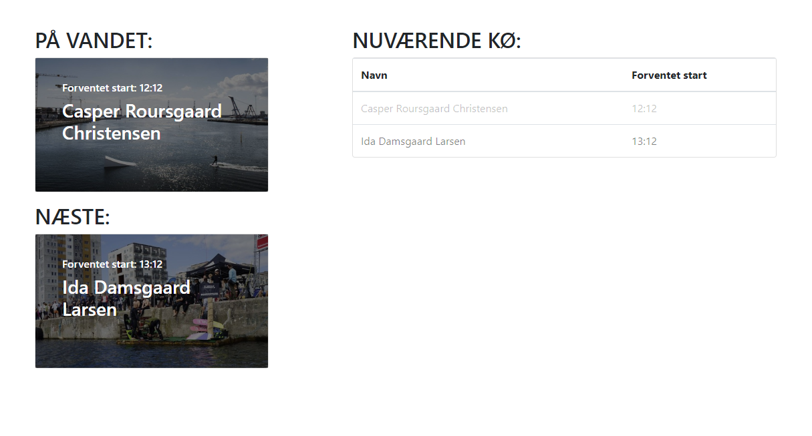
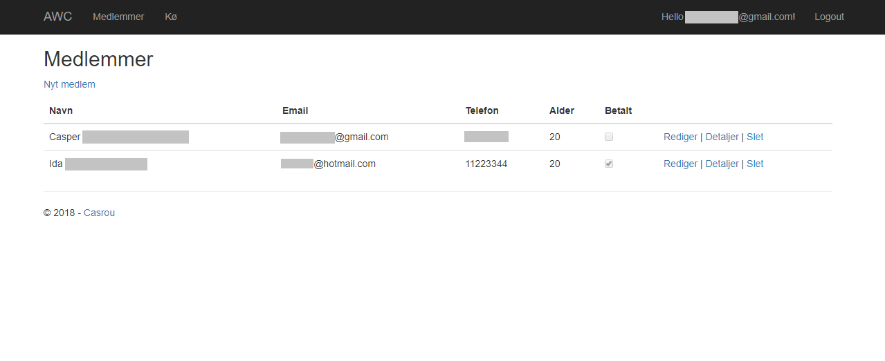
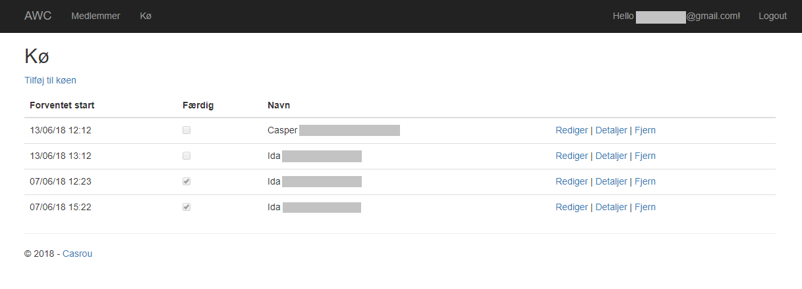

# Queue- and Membership System

## Scaffolded
- ASP.NET Core Razor Pages
- Authentication: Individual User Accounts

## Database
- SQLite
- Entity Framework Core

## Nuget Packages
- Microsoft.EntityFrameworkCore.Sqlite

## Configure
- Create new SQLite database
### `appsettings.json`
- Update connectionstring: "DefaultConnection": "DataSource=*name_of_database*.db"
### Package Manager Console
- Run `Update-Database -Context ApplicationDbContext`
- Run `Update-Database -Context MemberContext`
- Run `Update-Database -Context QueueContext`
